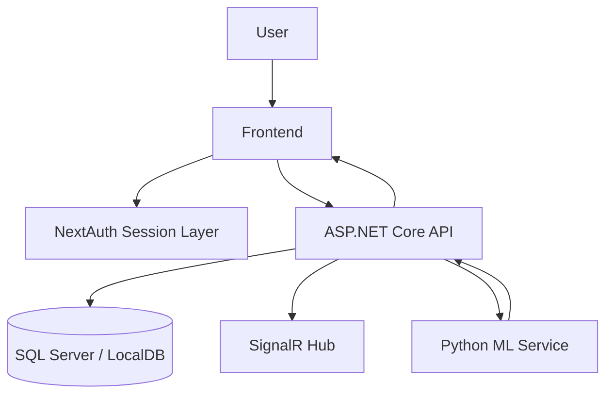
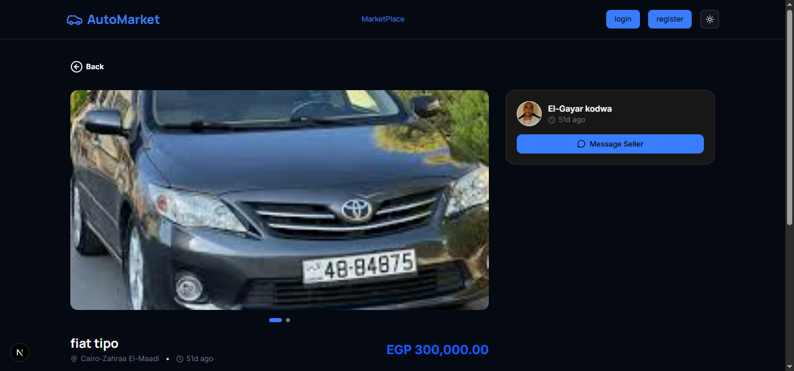
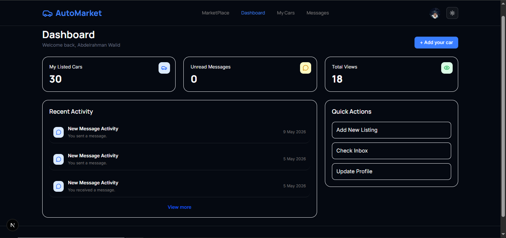
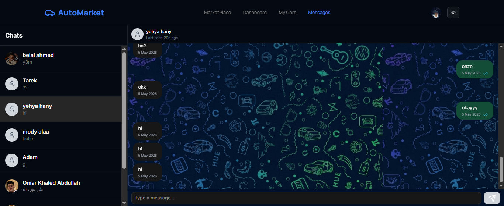
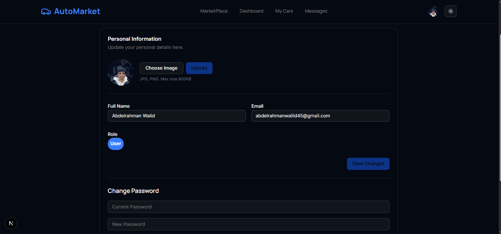

# 🚗 AutoMarket

### AI-Powered Full Stack Car Marketplace

<p align="center">
  
</p>

---

## 📖 Overview

AutoMarket is a complete car marketplace platform composed of a Next.js frontend, an ASP.NET Core backend, and a Python AI service for price estimation. The system supports browsing and filtering listings, authenticated user workflows, dashboard experiences, admin management, and real-time messaging.

---

## 🌟 Key Features

- ✅ Authentication
- ✅ JWT authorization
- ✅ Marketplace browsing
- ✅ Advanced search and filtering
- ✅ Brand and model filters
- ✅ Car details pages
- ✅ Create listing
- ✅ Edit listing
- ✅ Delete listing
- ✅ User dashboard
- ✅ Admin dashboard
- ✅ Real-time chat
- ✅ AI price estimation
- ✅ Responsive design
- ✅ Profile management

---

## 🛠 Tech Stack

| Layer | Technologies |
|---|---|
| Frontend | Next.js 16.1.6, React 19.2.3, TypeScript, Tailwind CSS, shadcn/ui, Radix UI |
| Backend | ASP.NET Core 9, C#, Entity Framework Core, Swagger |
| AI | Python, Flask, scikit-learn, pandas, NumPy, joblib |
| Database | SQL Server / LocalDB |
| Authentication | JWT Bearer, NextAuth Credentials, refresh tokens |
| Realtime | SignalR |
| Machine Learning | Regression model training and prediction API |

---

## 🏛 System Architecture



---

## 📂 Project Structure

```text
AutoMarket/
├── frontend/
├── backend/
├── AI Model/
├── screenshots/
└── README.md
```

- frontend/ contains the Next.js client application, routing, authentication, and UI components.
- backend/ contains the ASP.NET Core solution, controllers, services, domain models, infrastructure, and tests.
- AI Model/ contains the Flask-based machine learning service, training logic, and model artifacts.
- screenshots/ contains project screenshots used for documentation.

---

## 🚀 Main Modules

### Frontend

The frontend is a Next.js application that delivers the marketplace experience, authentication flows, listings, user dashboards, profile pages, admin tools, and real-time chat. It uses server actions, typed interfaces, and NextAuth for session management.

### Backend

The backend exposes REST APIs for authentication, car listings, dashboards, profiles, messaging, admin operations, and AI price estimation. It uses ASP.NET Core, EF Core, role-based authorization, and SignalR for chat.

### AI Model

The AI service loads or trains a regression model from local car data and serves prediction endpoints for price estimation. It is invoked by the backend when estimating listing prices.

---

## 📸 Screenshots

### Home


### Marketplace


### Car Details



### Dashboard



### Admin Panel


### Chat



### Profile



---

## ⚙️ Installation

1. Clone the repository

```bash
git clone <repository-url>
cd Car-Marketplace
```

2. Start the backend

```bash
dotnet restore backend/CarMarketplace.sln
dotnet run --project backend/CarMarketplace.API/CarMarketplace.API.csproj
```

3. Start the AI service

```bash
cd "AI Model/CarMarketplace.MLService"
python -m venv .venv
.\.venv\Scripts\activate
pip install -r requirements.txt
python app.py
```

4. Start the frontend

```bash
cd frontend/car-marketplace
npm install
```

Create a .env.local file with:

```env
BASE_URL=http://localhost:5127/
NEXTAUTH_SECRET=your_nextauth_secret_here
```

Then start the app:

```bash
npm run dev
```

---

## 🔄 System Workflow

A user request generally flows through the application in this order:

Frontend → Backend → Database → AI Service (for price estimation) → Response

The frontend renders the experience, the backend handles business logic and persistence, and the AI service contributes predictions when listing pricing is requested.

---

## 🔐 Security

The platform uses JWT-based authentication in the backend and NextAuth credentials in the frontend. Refresh token handling is implemented for session renewal, and access is restricted through roles such as User and Admin. Password reset and profile update flows are also supported.

---

## 🤖 AI Price Prediction

The backend exposes an AI endpoint that accepts car attributes and delegates the prediction request to the Python service. The Flask service validates the input, loads or trains a regression model, and returns a predicted price along with confidence context. The backend then transforms that output into a marketplace-friendly estimate for the client.

---

## 📈 Future Improvements

Potential next steps include containerized deployment, automated testing, CI/CD pipelines, broader analytics dashboards, and stronger observability for the AI and chat services.

---

## 🤝 Contributors

Contributions are welcome. Feel free to open an issue or submit a pull request with improvements, fixes, or documentation updates.

---

## 📄 License

This project is licensed under the MIT License.

---

⭐ If you found this project interesting, consider giving it a star!

Built with ❤️ using Next.js, ASP.NET Core and Python.