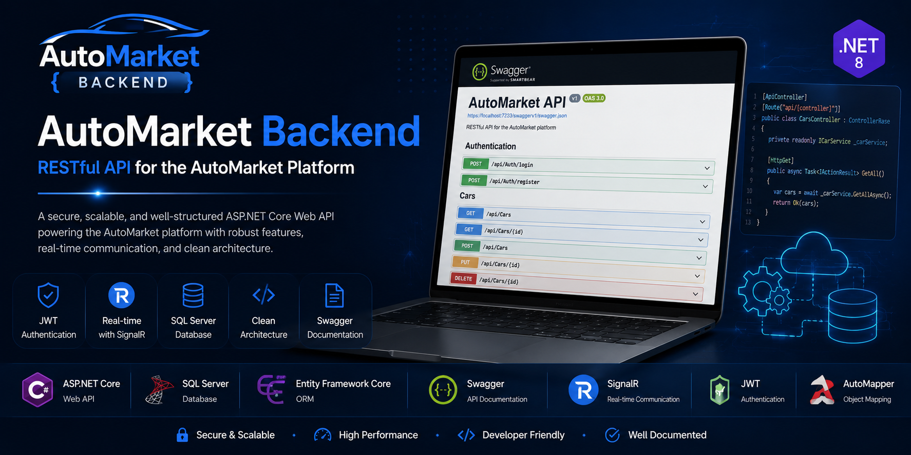
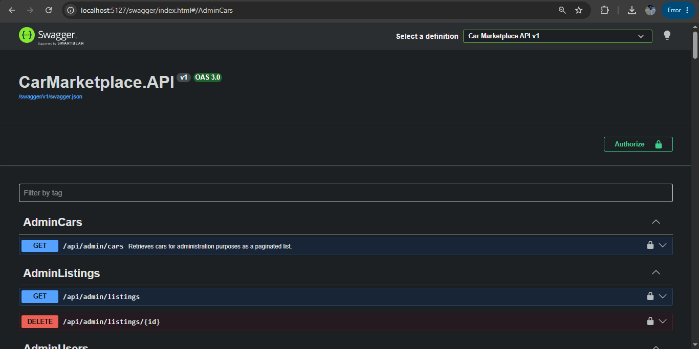
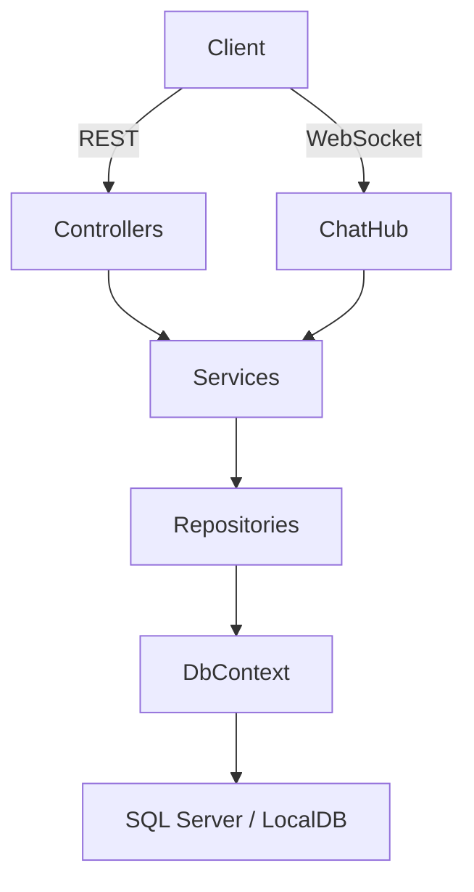

# 🚀 AutoMarket Backend

### RESTful Backend API built with ASP.NET Core

<p align="center">
  
</p>

---


---

## 📖 Overview

AutoMarket Backend is the API layer for a car marketplace platform. It supports authenticated user management, car listing workflows, admin controls, real-time messaging, image upload, AI-assisted pricing, and secure password reset.

---

## 🌐 Live API

> 🚧 Coming Soon

---

## ⭐ Project Highlights

- RESTful API built with ASP.NET Core 9
- Clean Architecture with API, Application, Domain, and Infrastructure layers
- Repository Pattern with Unit of Work
- JWT authentication with refresh token cookie flow
- Role-based authorization for Admin and User operations
- Real-time chat via SignalR
- Swagger/OpenAPI documentation
- FluentValidation request validation
- Automatic EF Core migrations at startup

---

## ✨ Features

- ✅ User registration and login
- ✅ JWT authentication
- ✅ Refresh token support
- ✅ Role-based authorization
- ✅ Car listings with image upload
- ✅ Paginated search and filtering
- ✅ User profile management
- ✅ Avatar upload
- ✅ Real-time SignalR chat
- ✅ Admin user, car, and listing management
- ✅ AI price estimate endpoint
- ✅ Password reset email flow
- ✅ Swagger documentation

---

## 📸 Screenshots

### Backend Banner


### Swagger UI



---

## 🛠 Tech Stack

| Category | Technology |
|----------|------------|
| Framework | ASP.NET Core 9.0 |
| Language | C# |
| ORM | Entity Framework Core 9.0.0 |
| Database | SQL Server / LocalDB |
| Authentication | JWT Bearer 9.0.0 |
| Real-Time | SignalR |
| Validation | FluentValidation 11.11.0 |
| Documentation | Swagger / Swashbuckle 10.1.2 |

---

## 📂 Project Structure

📦 `CarMarketplace.API`
- 📂 `Controllers` — REST API endpoints
- 📂 `Hubs` — SignalR chat hub
- 📂 `Configuration` — typed settings and validators
- 📂 `Middleware` — global error handling
- 📂 `Services` — API-specific helpers
- 📄 `Program.cs` — app startup and middleware pipeline
- 📄 `appsettings.json` — runtime configuration

📦 `CarMarketplace.Application`
- 📂 `DTOs` — shared data contracts
- 📂 `Interfaces` — business contracts
- 📂 `Services` — domain logic implementations
- 📂 `Validators` — FluentValidation rules

📦 `CarMarketplace.Domain`
- 📂 `Entities` — domain models
- 📂 `Enums` — shared enums

📦 `CarMarketplace.Infrastructure`
- 📂 `Data` — EF Core DbContext and migrations
- 📂 `Repositories` — data access implementations
- 📂 `Services` — infrastructure services
- 📂 `UnitOfWork` — transaction coordination

📦 `CarMarketplace.Tests`
- 📂 test projects covering backend behavior

---

## 🏗️ System Architecture



---

## ⚙️ Installation

1. Clone repository
   ```bash
   git clone <repo-url>
   cd backend
   ```

2. Restore packages
   ```bash
   dotnet restore CarMarketplace.sln
   ```

3. Configure app settings
   - Copy `CarMarketplace.API/appsettings.Development.example.json` to `CarMarketplace.API/appsettings.Development.json`
   - Update `ConnectionStrings:DefaultConnection`
   - Configure `JwtSettings` and optional `PasswordResetEmail` settings

4. Build
   ```bash
   dotnet build CarMarketplace.sln
   ```

5. Run
   ```bash
   dotnet run --project CarMarketplace.API/CarMarketplace.API.csproj
   ```

6. Optional: apply EF Core migrations manually
   ```bash
   dotnet ef database update --project CarMarketplace.Infrastructure/CarMarketplace.Infrastructure.csproj --startup-project CarMarketplace.API/CarMarketplace.API.csproj
   ```

---

## 🔑 Configuration

Example `CarMarketplace.API/appsettings.json`:

```json
{
  "ConnectionStrings": {
    "DefaultConnection": "Server=(localdb)\\mssqllocaldb;Database=CarMarketplaceDb;Trusted_Connection=True;MultipleActiveResultSets=true"
  },
  "JwtSettings": {
    "SecretKey": "YourSuperSecretKeyThatShouldBeAtLeast32CharactersLongForSecurity!",
    "Issuer": "CarMarketplaceAPI",
    "Audience": "CarMarketplaceUsers",
    "ExpirationInMinutes": 60,
    "RefreshTokenExpirationDays": 7
  },
  "Cors": {
    "AllowedOrigins": [
      "https://localhost:3000",
      "http://localhost:3000"
    ]
  },
  "RefreshTokenCookie": {
    "Path": "/api/auth",
    "SameSite": "Lax"
  },
  "PasswordResetEmail": {
    "FrontendBaseUrl": "https://frontend",
    "SmtpHost": "localhost",
    "SmtpPort": 25,
    "EnableSsl": false,
    "SmtpUsername": "",
    "SmtpPassword": "",
    "FromEmail": "no-reply@carmarketplace.local",
    "FromName": "Car Marketplace"
  }
}
```

> Do not commit secrets. Use environment variables or secure secret storage for production.

---

## 📜 API Documentation

Swagger is available in development mode at:

`https://localhost:<port>/swagger`

---

## 🔗 API Modules

- Authentication
- User management
- Car listings
- Profile and avatar upload
- Admin management
- Messaging
- Dashboard
- AI price estimation
- Debug diagnostics

---

## 🔐 Authentication & Authorization

- JWT Bearer authentication for API requests
- Refresh token transport via secure cookies
- CSRF protection for refresh and logout flows
- Role-based access control with Admin and User roles
- Security stamp validation for token revocation

---

## 🗄️ Database

- SQL Server / LocalDB engine
- EF Core 9.0.0 ORM
- Automatic migrations at startup
- Clean repository and unit-of-work layering

---

## 📡 Real-Time Communication

- SignalR hub at `/hubs/chat`
- Authenticated real-time messaging transport
- Per-user group routing for direct notifications
- In-memory connection tracking for single-instance support

---

## 🚀 Future Improvements

- Add Docker and container deployment support
- Add distributed SignalR backplane for scaling
- Expand integration and API contract tests
- Add frontend client examples and SDK documentation

---

## 🤝 Contributing

1. Fork the repository
2. Create a feature branch
3. Restore and build with `dotnet restore` and `dotnet build`
4. Open a pull request with a clear description

---

## 📄 License

MIT License

---

⭐ If you found this project useful, consider giving it a star!
