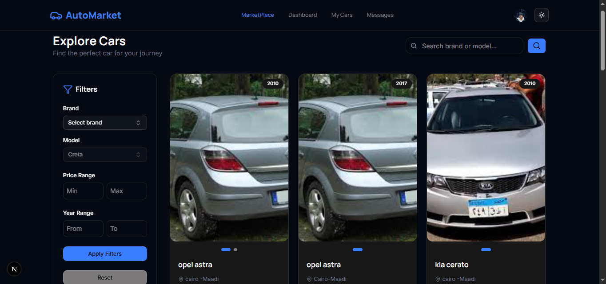
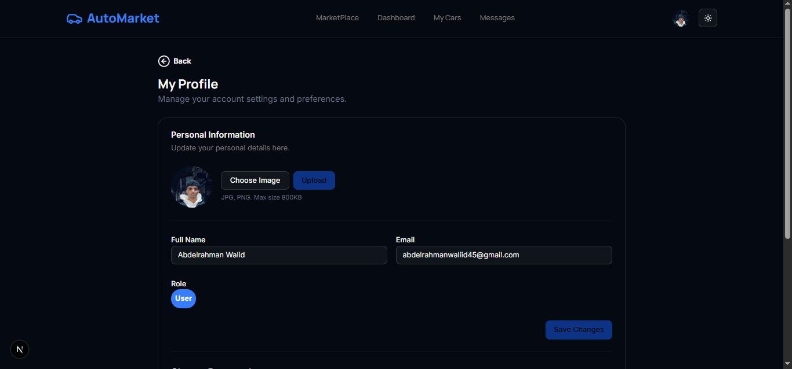

# 🚗 AutoMarket

### AI-Powered Car Marketplace built with Next.js & TypeScript

<p align="center">
  
</p>

---
 


---

## Overview

A responsive frontend for a car marketplace. Built with the Next.js App Router and TypeScript, the codebase implements listing discovery, search & filters, profile and admin pages, and real-time 1:1 chat backed by SignalR. The app uses a component-driven UI (shadcn + Radix) and Tailwind-based theming.

---

## Live Demo

> 🚧 Coming Soon

---

## Demo


---

## Project Highlights

- Modern Next.js App Router architecture (`src/app`)
- Type-safe development with TypeScript
- Real-time messaging with Microsoft SignalR
- Secure authentication with NextAuth (Credentials provider)
- Responsive UI and theming via Tailwind CSS & `next-themes`
- Server-side actions and focused API wrappers in `src/actions`
- Component-driven UI using shadcn + Radix primitives

---

## Screenshots

### Home Page



### Marketplace


### Car Details


### Dashboard


### Chat


### Profile



---

## Features

- Authentication (NextAuth credentials provider)
- Marketplace: browse, search, filter, pagination
- Listing management: create / edit / delete (with images)
- Profile: view / update, avatar upload, change password
- User dashboard (my-cars, stats)
- Admin panel: manage users & listings
- Real-time 1:1 chat with presence & typing indicators (SignalR)
- Form handling & validation (`react-hook-form`, `zod`)
- Notifications (`react-hot-toast`)

---

## Tech Stack

| Category | Technology |
|---:|:---|
| Framework | Next.js 16.1.6 |
| Language | TypeScript (>=5) |
| UI Library | React 19.2.3 |
| Styling | Tailwind CSS (v4), shadcn, CSS variables |
| Authentication | NextAuth 4.24.13 |
| Real-time | @microsoft/signalr 10.0.0 |
| Forms & Validation | react-hook-form, zod |
| HTTP | native fetch (server + client) |
| Icons | lucide-react 0.574.0 |
| Carousel | embla-carousel-react 8.6.0 |

---

## Project Structure

```
src/
  app/                # Next.js App Router pages & layout
    (pages)/
      market-place/   # marketplace, listing pages
      (auth)/         # login, register, reset password
      user/           # dashboard, my-cars, messages
      admin/          # admin panel
    api/              # next-auth route: api/auth/[...nextauth]
  actions/            # server actions / API wrappers
  components/         # UI components (layout, auth, Chat, ui)
  services/           # SignalR helper
  Interface/          # TypeScript interfaces
  lib/                # small utilities (twMerge)
  app/globals.css     # Tailwind + theme tokens
```

Key files:

- `src/auth.ts` — NextAuth options & callbacks
- `src/actions/*` — server actions and API wrappers
- `src/services/signalr.ts` — SignalR connection helper

---

## Architecture

```mermaid
graph TD
  User[User] -->|HTTP| Browser(Browser / Client)
  Browser -->|SSR/CSR| Frontend[Next.js Frontend]
  Frontend -->|auth calls| NextAuthRoute[NextAuth API Route]
  NextAuthRoute -->|credentials| BackendAPI[Backend API (BASE_URL)]
  Frontend -->|REST| BackendAPI
  BackendAPI -->|reads/writes| Database[(Database)]
  BackendAPI -->|hosts hub| SignalRHub[SignalR Hub]
  Frontend -->|SignalR| SignalRHub
  SignalRHub --> ChatService[Chat Service / Hub]
```

---

## Installation

1. Install dependencies

```bash
npm install
```

2. Create environment variables

Create a `.env.local` with at least:

```env
BASE_URL=http://localhost:5127/
NEXTAUTH_SECRET=your_nextauth_secret_here
```

3. Run development server

```bash
npm run dev
```

4. Build & start (production)

```bash
npm run build
npm start
```

Note: the frontend expects a backend API reachable at `BASE_URL` (this workspace used `http://localhost:5127/` during development).

---

## Environment Variables

Add to `.env.local` (do not commit secrets):

```env
# Base URL for backend API (include trailing slash)
BASE_URL=

# NextAuth secret
NEXTAUTH_SECRET=
```

---

## Available Scripts

- `dev` — start Next.js in development mode (`next dev`)
- `build` — compile the app for production (`next build`)
- `start` — start the Next.js production server (`next start`)
- `lint` — run ESLint (`eslint`)

(See `package.json` for exact definitions.)

---

## API Integration

- All API calls use native `fetch` and target `process.env.BASE_URL + 'api/...'` (see `src/actions/*`).
- Authentication: NextAuth Credentials provider posts to `api/Auth/login` and stores a token in the NextAuth session (`src/auth.ts`). Server actions call `getServerSession` and attach `Authorization: Bearer <token>` to protected endpoints.
- Real-time chat: connects to `http://localhost:5127/hubs/chat` and supplies the JWT as SignalR access token (`src/services/signalr.ts`).

---

## UI Highlights

- Responsive marketplace layout with search, filters and paginated results
- Mobile & desktop-optimized listing cards (`src/components/layout/CarItemMobile.tsx`, `src/components/layout/CarItemDesktop.tsx`)
- Admin management UI with table primitives (`src/components/layout/AdminPanelClient.tsx`)
- Reusable UI primitives under `src/components/ui` and theme support with `next-themes`

---

## Responsive Design

Built with Tailwind CSS responsive utilities — layout adapts across breakpoints and includes mobile-specific components.

---

## Future Improvements

- Add automated tests (unit / E2E) and CI
- Centralize API error handling and client helpers
- Improve accessibility across chat and admin components
- Add image optimization and CDN-backed uploads

---

## Contributing

Contributions are welcome. Open an issue or submit a focused pull request. Please follow existing TypeScript types and component patterns.

---

## 📄 License

MIT License.

---

⭐ If you found this project interesting, consider giving it a star!